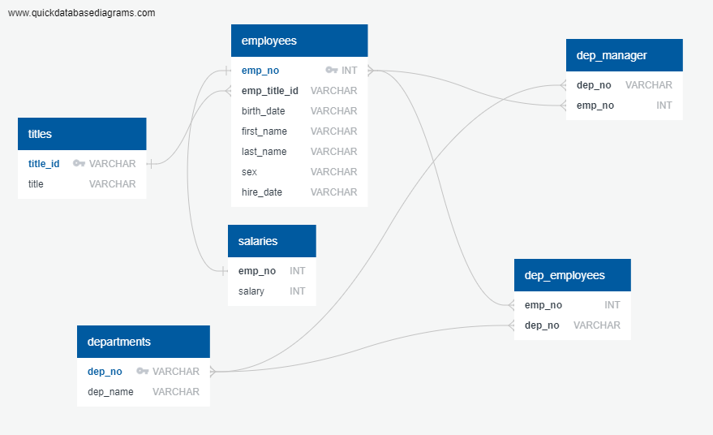
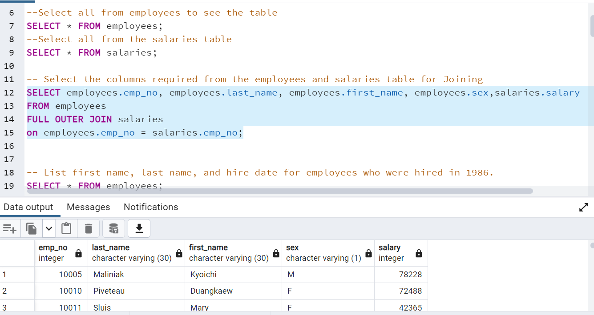
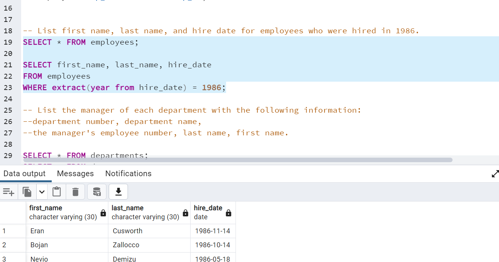
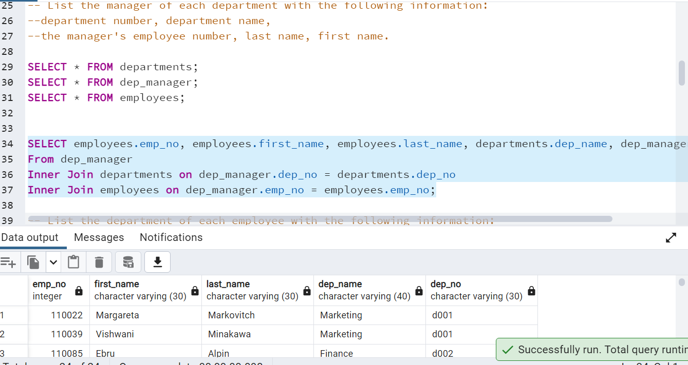

# SQL Challenge - Employee Database

SQL stands for Structured Query Language. It is an international standard for database manipulation. It is used to extract and organize data that is stored in a relational database that are further used for analysis. A database is a table that consists of rows and columns. Even when the analysis is being done on another platform like Python or R, SQL is needed for fetching the Data from a company's database.

In this assignment, our main task as a new data engineer is is a research project on employees of the corporation from the 1980s and 1990s. All that remains of the database of employees from that period are six CSV files. We need to design the tables to hold data in the CSVs, import the CSVs into a SQL database, and answer questions about the data. In other words, we will perform data modeling, data engineering, and data analysis.  

## Configuration: 
Before we being , we need to do the following: 
 * Create a new repository for this project called sql-challenge and clone the new repository to our computer.  
 * Inside our local Git repository, create a directory for the SQL challenge.  
 * Make a folder named EmployeeSQL.  
 * Add our files to this folder.  
 * Push these changes to GitHub.

## Steps and Instruction:  

This assignment is divided into three parts: data modeling, data engineering, and data analysis.

### 1) Data Modeling:
We need to inspect the CSVs and sketch out an ERD of the tables. We will use http://www.quickdatabasediagrams.com as our tool for sketching.  

### 2) Data Engineering:  

* We need to create a table schema for each of the six CSV files provided. We need to specify data types, primary keys, foreign keys, and other constraints.  
* For the primary keys, we need to verify that the column is unique. Otherwise, we would create a composite key, which takes two primary keys to uniquely identify a row.
* We need to create tables in the correct order to handle foreign keys. 
* We need to import each CSV file into the corresponding SQL table in the same order that the tables were created 

### 3) Data Analysis: 
Once the database is made, we need to answer the following:

* List the following details of each employee: employee number, last name, first name, sex, and salary.
* List first name, last name, and hire date for employees who were hired in 1986.
* List the manager of each department with the following information: department number, department name, the manager's employee number, last name, first name.
* List the department of each employee with the following information: employee number, last name, first name, and department name.
* List first name, last name, and sex for employees whose first name is "Hercules" and last names begin with "B."
* List all employees in the Sales department, including their employee number, last name, first name, and department name.
* List all employees in the Sales and Development departments, including their employee number, last name, first name, and department name.
* List the frequency count of employee last names (i.e., how many employees share each last name) in descending order.

## Conclusion:

By making the ERD flow chart as shown below and creating the table schema with their respective primary keys and foreign keys for each of the six CSV files provided, it made the analysis easy.  

Here are some of the analysis's required: 

I was able to find the details of each employee . Their employee number, last name, first name, sex, and salary as below :

The details of employees hired in 1986 are as follows:

The details of the manager of each department with the following information: department number, department name, the manager's employee number, last name, first name. As Follows:

